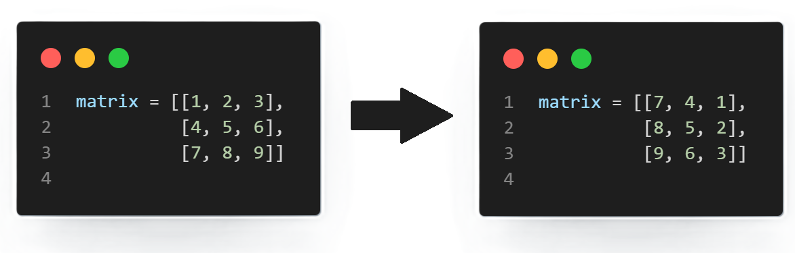

# 0x07. Rotate 2D Matrix 🔁

<!--  -->



This project aims to implement a solution for rotating a 2D matrix by 90 degrees clockwise.

## 🔧 Requirements and Dependencies

- Python 3.8.10 🐍
- pycodestyle 2.8.0 📦

##  📚 Tasks:

### 📝 Rotate 2D Matrix
---------------------
**📜 Task requirements:**
Given an `n` x `n` 2D matrix, rotate it 90 degrees clockwise. The matrix must be edited in-place.

```python
matrix = [[1, 2, 3],
          [4, 5, 6],
          [7, 8, 9]]

rotate_2d_matrix(matrix)
print(matrix)
```
**Expected Output:**
```
[[7, 4, 1],
 [8, 5, 2],
 [9, 6, 3]]
```

**🗂️ Files:** 
- **[0-rotate_2d_matrix.py](0-rotate_2d_matrix.py)**

**🗒️ Description:** 
The file `0-rotate_2d_matrix.py` contains a function `rotate_2d_matrix` that rotates a 2D matrix 90 degrees clockwise in-place. The algorithm traverses the matrix layer by layer, swapping elements in the four corners to achieve the rotation.

## 🎓 Key Takeaways

- Implemented an in-place rotation algorithm for 2D matrices.
- Enhanced understanding of matrix manipulation in Python.

## 📫 Contact Me

[](https://github.com/BinyamMamo)
[](mailto:binyammamo01@gmail.com)
[](https://linkedin.com/in/binyammamo)
[](#)
[](https://binyammamo.github.io)

<pre id="banner" class="color-change" style="color: #449999" align="center">


 █████╗ ██╗     ██╗  ██╗    ███████╗██╗    ██╗███████╗
██╔══██╗██║     ╚██╗██╔╝    ██╔════╝██║    ██║██╔════╝
███████║██║      ╚███╔╝     ███████╗██║ █╗ ██║█████╗  
██╔══██║██║      ██╔██╗     ╚════██║██║███╗██║██╔══╝  
██║  ██║███████╗██╔╝ ██╗    ███████║╚███╔███╔╝███████╗
╚═╝  ╚═╝╚══════╝╚═╝  ╚═╝    ╚══════╝ ╚══╝╚══╝ ╚══════╝
                                                      
</pre>